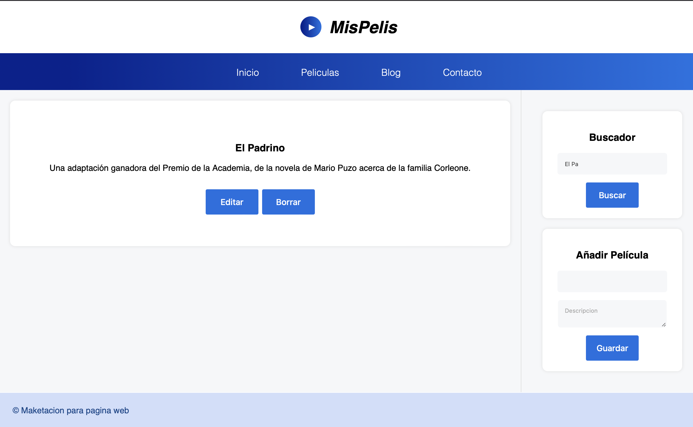

# MisPelis
Mis pelis es un sitio web alimentado con el localstorage del navegador que es capaz de manejar todo un sistema de CRUD a través de React. Para correr el proyecto solo es necesario ingresar a la carpeta 06-mispelis y correr el comando *npm start*

## Pagina Inicial

## Busqueda

