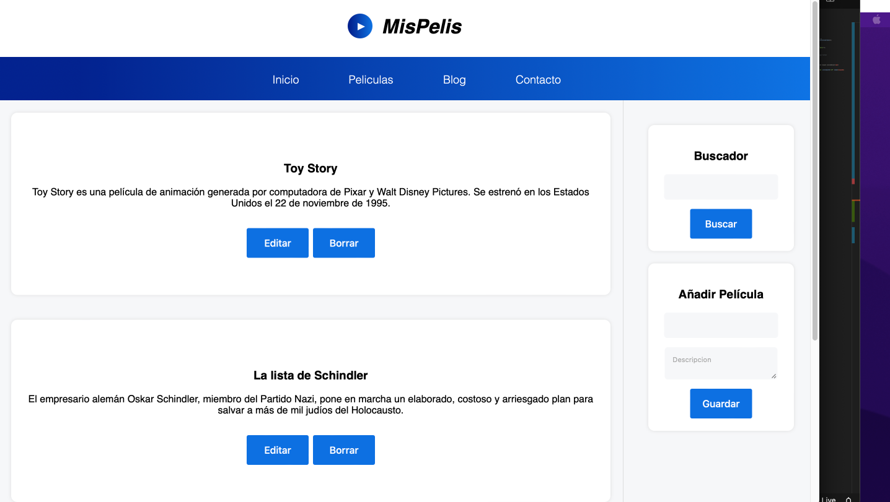
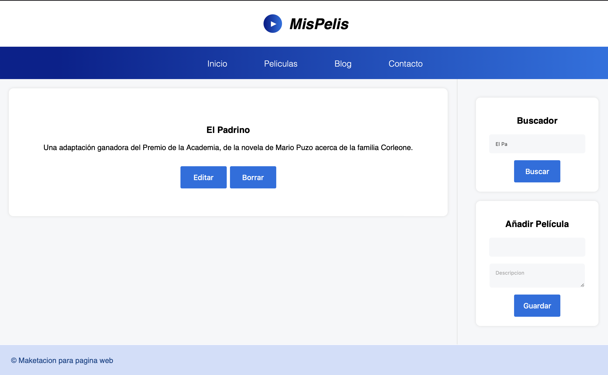

# MisPelis
Mis pelis es un sitio web alimentado con el localstorage del navegador que es capaz de manejar todo un sistema de CRUD a través de React. Para correr el proyecto solo es necesario ingresar a la carpeta 06-mispelis y correr el comando *npm start*

## Pagina Inicial

## Busqueda

## Fuentes
Como base se utilizo el [curso](https://www.udemy.com/course/master-en-react-aprender-reactjs-hooks-mern-nodejs-jwt/) Master en React: Aprender ReactJS, Hooks, MERN, NodeJS, JWT+ en Udemy
